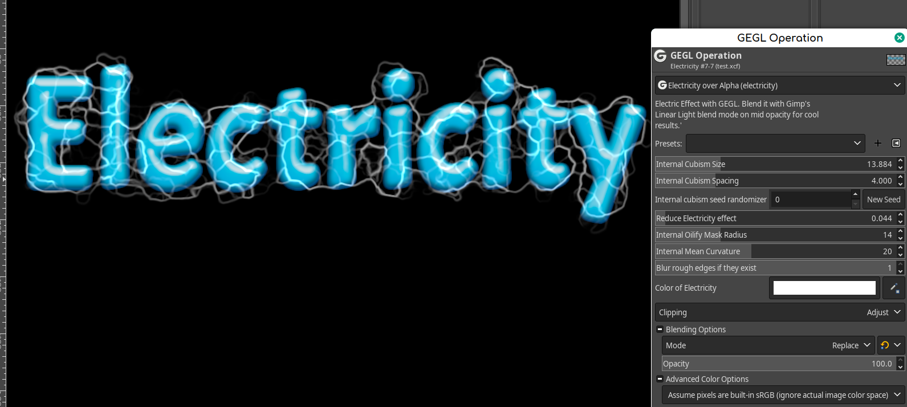
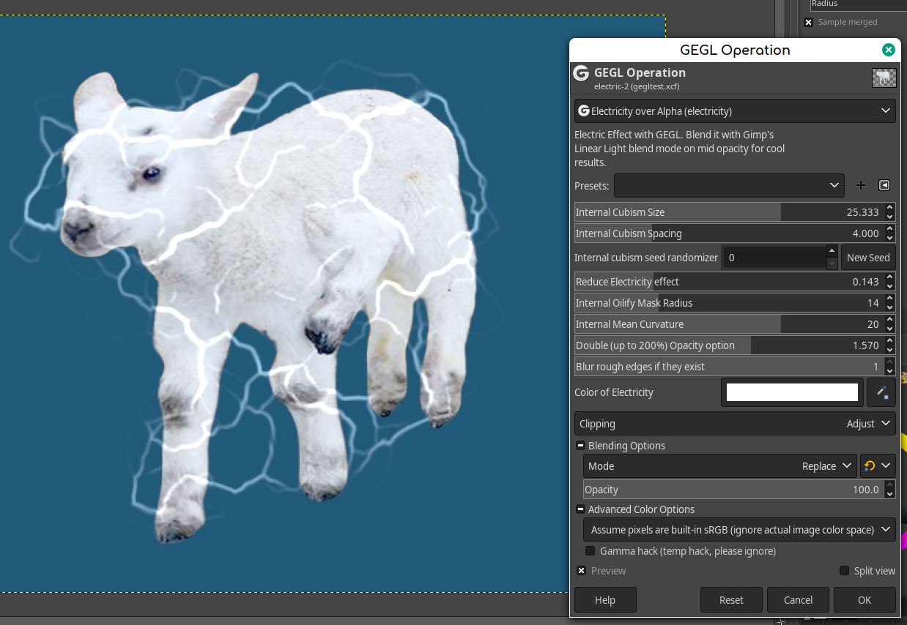
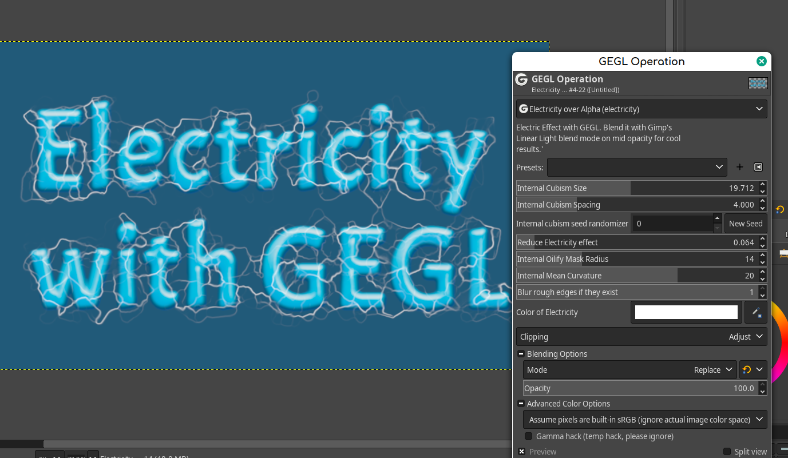
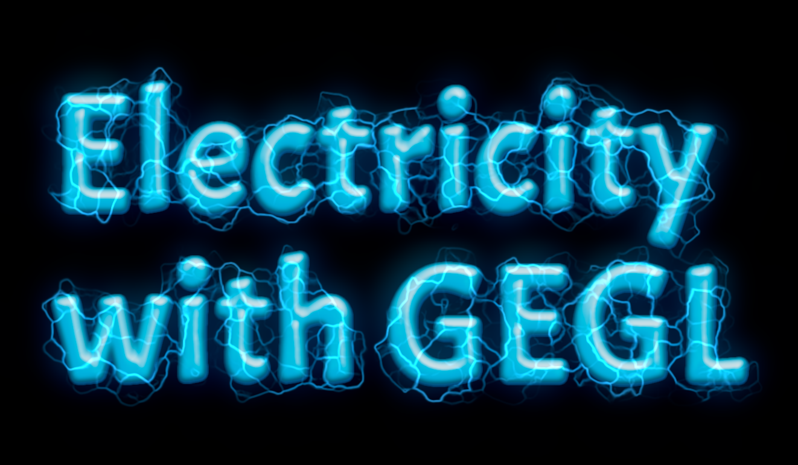
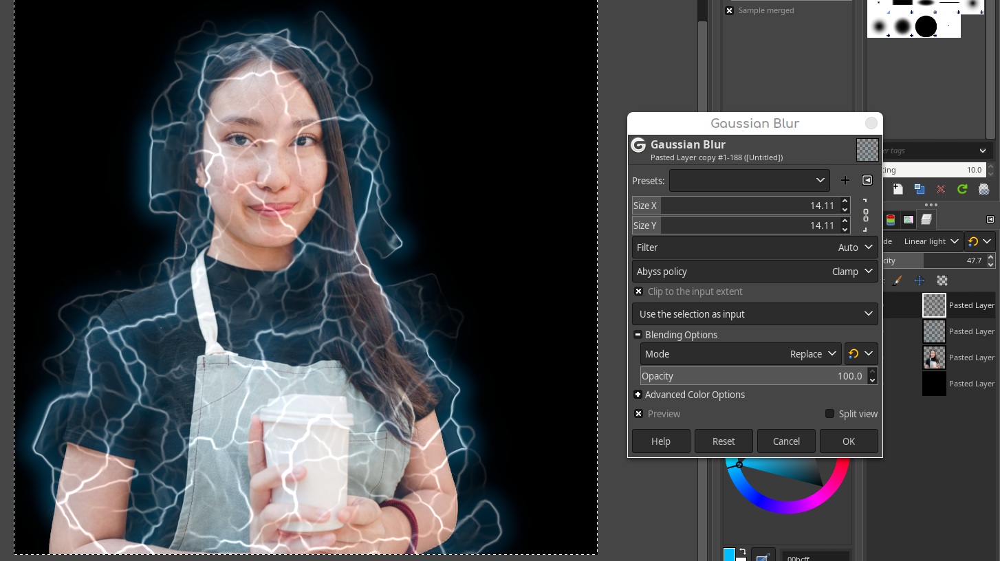

# GEGL-Electricity
GEGL does an Electric Effect on an image covered by transparency



## OS specific location to put GEGL Filter binaries 

Windows
 C:\\Users\<YOUR NAME>\AppData\Local\gegl-0.4\plug-ins
 
 Linux 
 /home/(USERNAME)/.local/share/gegl-0.4/plug-ins
 
 Linux (Flatpak)
 /home/(USERNAME)/.var/app/org.gimp.GIMP/data/gegl-0.4/plug-ins


## Compiling and Installing

### Linux

To compile and install you will need the GEGL header files (`libgegl-dev` on
Debian based distributions or `gegl` on Arch Linux) and meson (`meson` on
most distributions).

```bash
meson setup --buildtype=release build
ninja -C build

```

If you have an older version of gegl you may need to copy to `~/.local/share/gegl-0.3/plug-ins`
instead (on Ubuntu 18.04 for example).


### Windows

The easiest way to compile this project on Windows is by using msys2.  Download
and install it from here: https://www.msys2.org/


Open a msys2 terminal with `C:\msys64\mingw64.exe`.  Run the following to
install required build dependencies:

```bash
pacman --noconfirm -S base-devel mingw-w64-x86_64-toolchain mingw-w64-x86_64-meson mingw-w64-x86_64-gegl
```

Then build the same way you would on Linux:

```bash
meson setup --buildtype=release build
ninja -C build
```

## More previews of this based Gimp plugin used with other plugins of mine like Glossy Balloon and a linear light blend
https://github.com/LinuxBeaver/GEGL-glossy-balloon-text-styling











